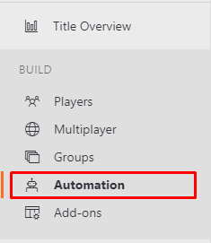
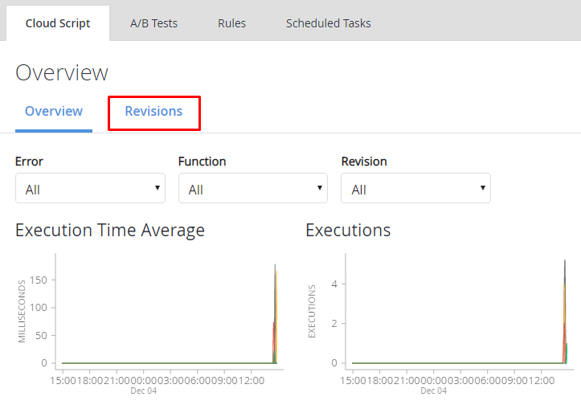
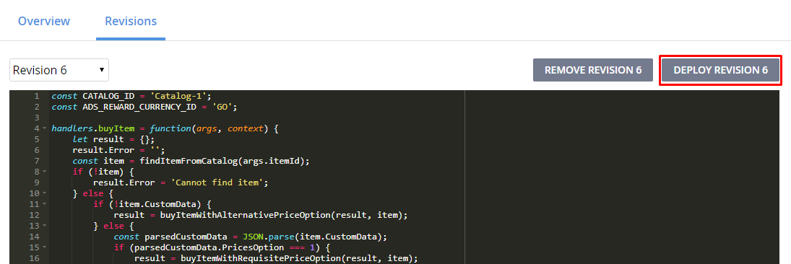

# dot-io-playfab-cloudcodes
Cloud codes for `dot-io-playfab-client`

## How to deploy it

1. Go to your Playfab title dashboard
2. Select to `Automation` menu

3. Select to `Revision` tab

4. Copy codes from `script.js` [here](https://github.com/insthync/dot-io-playfab-cloudcodes/blob/master/script.js)

5. Paste it, then save by click `Save As Revision` button

6. Deploy it by click `Deploy Revision` button

